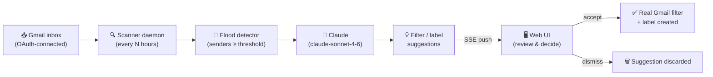
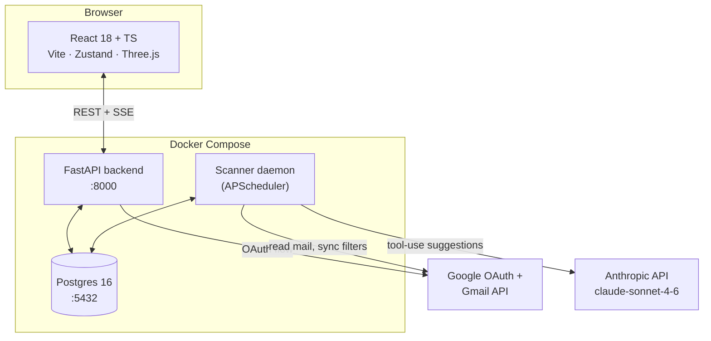
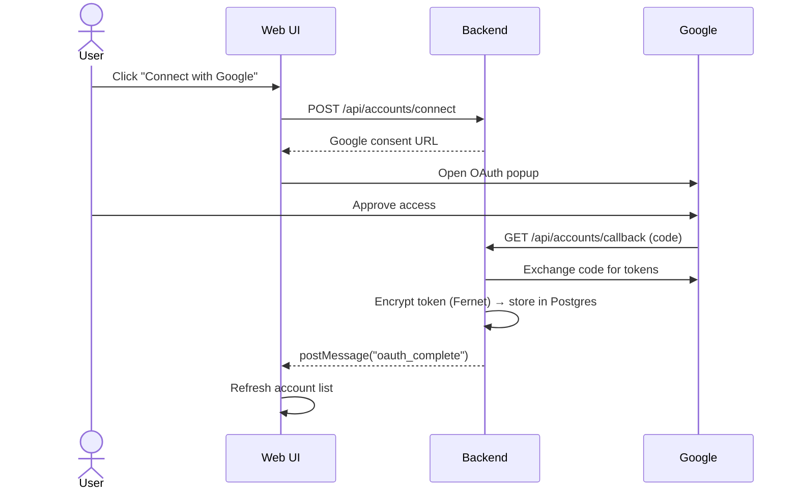

<div align="center">

# 📬 GmailFilter

### AI-powered Gmail triage — detect email floods, generate filter & label suggestions, and clean up your inbox with one click.

[](https://github.com/Eidan121/GmailFilter/actions/workflows/docker-publish.yml)


</div>

---

## ✨ What it does

GmailFilter watches your inbox in the background, finds senders that are flooding you with mail,
and asks Claude to draft a filter + label for each one. You review the suggestions in a clean web
UI and accept or dismiss them — accepted suggestions become **real Gmail filters and labels**,
created through the Gmail API.



## 🧭 Why

Inboxes drown in repetitive senders — newsletters, notifications, automated receipts — and writing
Gmail filters by hand is tedious. GmailFilter automates the *boring part* (spotting the patterns and
drafting the rule) while keeping you in control of the *important part* (deciding what actually gets
filtered).

## 🚀 Features

| | |
|---|---|
| 🔐 **Secure Google OAuth** | Connect any number of Gmail accounts. Tokens are encrypted (Fernet) and stored in Postgres — never written to disk as plaintext files. Each reconnect rolls the stored token over. |
| 🌊 **Flood detection** | A background scanner finds senders crossing a configurable volume threshold (`FLOOD_THRESHOLD`). |
| 🤖 **AI suggestions** | Claude turns flood data into structured filter criteria, a suggested label, and a short rationale — using tool calls, not free-text parsing. |
| ⚡ **Live updates** | Scan progress and new suggestions stream to the UI in real time over Server-Sent Events. |
| 🏷️ **Full label & filter management** | Create, edit, and delete Gmail labels and filters directly from the dashboard (the Gmail Filters API has no "update" — GmailFilter handles the delete+recreate dance for you). |
| 🐳 **One-command deploy** | `docker compose up --build` brings up Postgres, the API, the background scanner, and the built frontend. |

## 🏗️ Architecture



**Stack**

- **Backend** — FastAPI · SQLAlchemy 2.0 + Alembic · Postgres · APScheduler · `google-api-python-client` · Anthropic SDK · managed with [`uv`](https://docs.astral.sh/uv/)
- **Frontend** — React 18 + TypeScript · Vite · React Router 7 · Zustand · Three.js / R3F · managed with [`pnpm`](https://pnpm.io/)
- **Infra** — Docker Compose (Postgres, API, scanner, static frontend) · GitHub Actions → GHCR

## 🔑 How accounts get connected

End users never touch Google Cloud Console, client IDs, or secrets — they just click **Connect with
Google** and approve the standard consent screen:



> Registering an OAuth client in Google Cloud Console is a **one-time operator step** (see
> [Setup](#-setup) below) — it's how every Gmail-integrated app works, including this one's closest
> open-source cousins like [Inbox Zero](https://github.com/elie222/inbox-zero).

## 📦 Setup

### 1. One-time: register a Google OAuth client *(you, the operator — not your end users)*

1. Google Cloud Console → **APIs & Services → Credentials → Create OAuth 2.0 Client ID**
2. Application type: **Web application**
3. Authorized redirect URI: `http://localhost:8000/api/accounts/callback`
4. Copy the **Client ID** and **Client secret**

### 2. Configure environment

```bash
cp .env.example .env
```

Fill in:

```ini
ANTHROPIC_API_KEY=sk-ant-...
GOOGLE_CLIENT_ID=your-client-id.apps.googleusercontent.com
GOOGLE_CLIENT_SECRET=your-client-secret
```

### 3. Run everything

```bash
docker compose up --build
```

| Service | URL |
|---|---|
| Frontend | http://localhost |
| API | http://localhost:8000 |
| Postgres | localhost:5432 |

## ☁️ Deploying to Google Cloud (Compute Engine)

CI/CD (`.github/workflows/docker-publish.yml`) builds images, pushes them to GHCR, then SSHes
into a Compute Engine VM and runs `docker compose pull && up -d` to roll out the new version.

**One-time VM setup:**

1. Create a Compute Engine VM (Ubuntu 22.04, e2-small/medium, static external IP, allow HTTP/HTTPS)
2. SSH in, install Docker + the Compose plugin
3. `git clone` this repo into `~/GmailFilter` and copy your `.env` over (never commit it)
4. Update your Google OAuth client's redirect URI to point at the VM's address
5. (Recommended) put a domain + HTTPS in front (Caddy/nginx + Let's Encrypt) — Google requires
   HTTPS redirect URIs for non-localhost OAuth clients

**Required GitHub Actions secrets** for the deploy step (Settings → Secrets and variables → Actions):

| Secret | Value |
|---|---|
| `GCP_VM_HOST` | VM's external IP or domain |
| `GCP_VM_USER` | SSH username on the VM |
| `GCP_VM_SSH_KEY` | Private SSH key with access to the VM |
| `GHCR_TOKEN` | A GitHub PAT (or `GITHUB_TOKEN`) with `read:packages`, used by the VM to pull images |

## 🛠️ Local development (without Docker)

<details>
<summary><strong>Backend</strong></summary>

```bash
cd backend
uv sync
uv run alembic upgrade head
uv run uvicorn app.main:app --reload --port 8000   # API
uv run python -m app.scanner.daemon                # background scanner (separate terminal)
```
</details>

<details>
<summary><strong>Frontend</strong></summary>

```bash
cd frontend
pnpm install
pnpm dev      # → http://localhost:5173
```
</details>

<details>
<summary><strong>Tests</strong></summary>

```bash
cd backend
uv run pytest tests/ -v
```
</details>

## 🔒 Security notes

- Gmail OAuth tokens are **encrypted at rest** (Fernet) and stored in Postgres, not as plaintext
  files — see `backend/app/services/oauth.py`.
- Reconnecting an account **rolls over** the stored token; old tokens don't linger.
- Secrets (`.env`, `client_secrets.json`, `token.key`, the database) are git-ignored — see
  [`.gitignore`](.gitignore).

## 📄 License

This project is provided as-is for personal/self-hosted use. Add a license of your choice if you
plan to distribute it.
